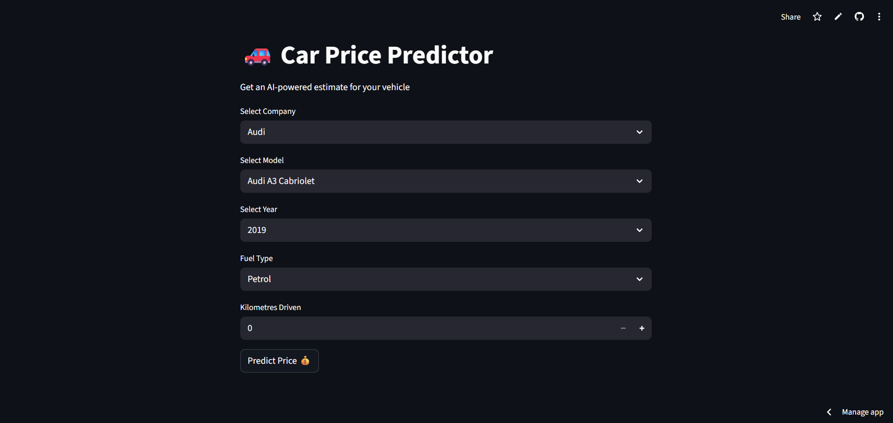
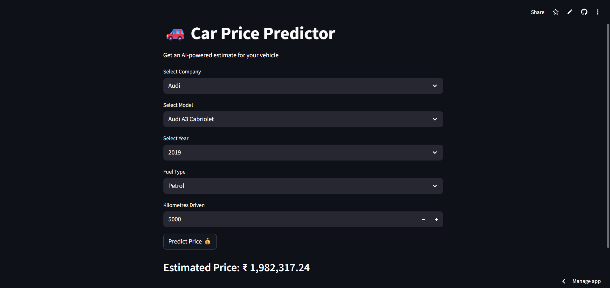

## 📸 Screenshots

### 🔹 Application Demo Interface

---

### 🔹 Prediction Example

---

## 🔗 Live Demo

👉 https://car-price-ai.streamlit.app/

Try different combinations of:

- Car Company
- Model
- Year
- Fuel Type
- Kilometres Driven

---

## ⚙ How It Works

1️⃣ **Data Collection**  
The model is trained using a cleaned dataset of used car listings.

2️⃣ **Feature Engineering**  
Key features include:

- Car Name
- Company
- Year
- Fuel Type
- Kilometres Driven

3️⃣ **Preprocessing Pipeline**

- OneHotEncoding for categorical features
- Numerical feature handling

4️⃣ **Model Training**

A regression model learns pricing patterns from historical data.

5️⃣ **Prediction**

User inputs → Model inference → Estimated price output.

---

## 🎯 Learning Outcomes

This project showcases:

✔ End-to-end ML workflow  
✔ Data preprocessing techniques  
✔ Model persistence & loading  
✔ Streamlit-based UI development  
✔ Cloud deployment  

---

## 🚀 Future Improvements

- Upgrade to RandomForest / XGBoost
- Add price confidence range
- Feature importance visualization
- Advanced analytics dashboard

---

## 👨‍💻 Author

**Vishwajit Deshmukh**

---

⭐ If you found this project interesting, feel free to star the repository!
